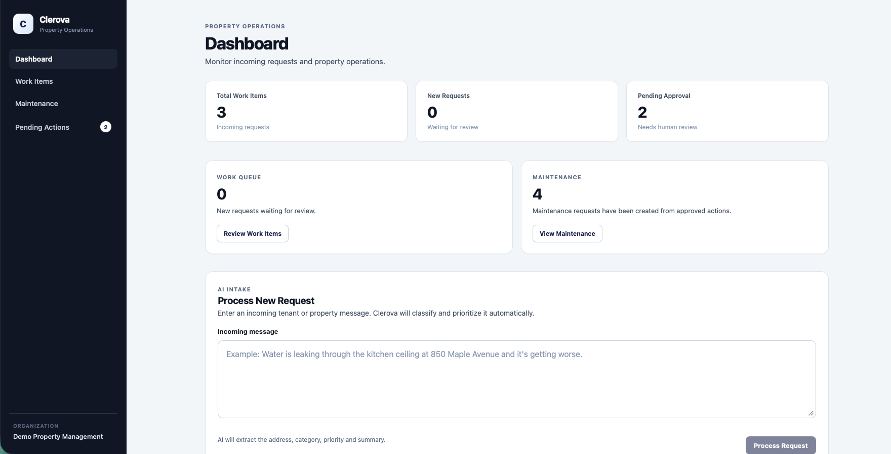
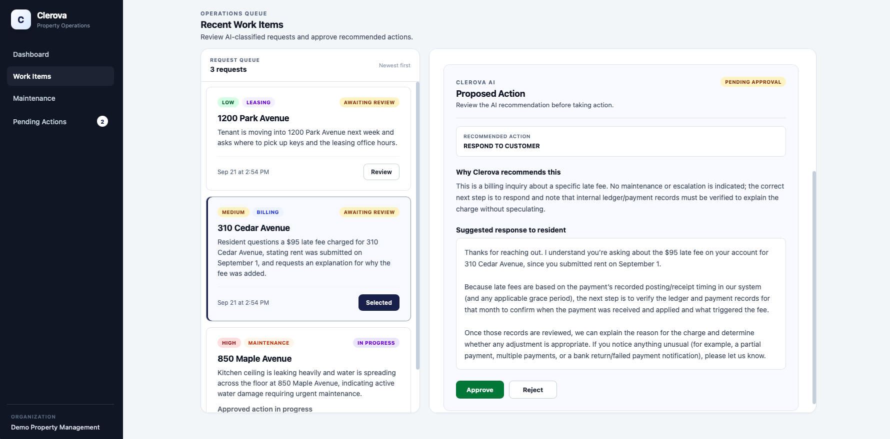
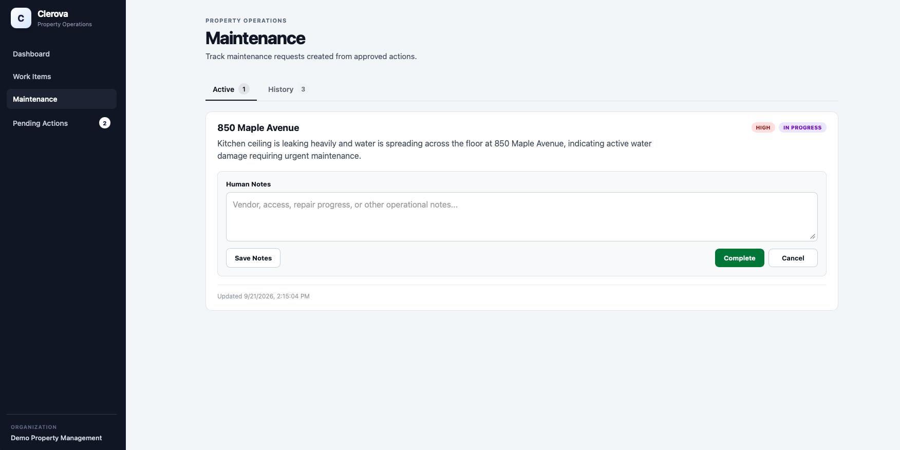

# Clerova

**AI-assisted property operations with human oversight**

Clerova is a full-stack application that turns incoming resident and property messages into structured operational work.

Instead of requiring staff to manually read, classify, prioritize, and route every request, Clerova uses AI to extract key information, recommend the next action, and place consequential actions behind human approval.

The current MVP focuses on property-management operations and includes end-to-end AI intake, human review, and maintenance workflows.

**Live Application:** https://app.clerova-ai.com  
**API:** https://api.clerova-ai.com  
**Website:** https://clerova-ai.com

---

## What Clerova Does

A property manager can submit an incoming message such as:

> Water is leaking rapidly from under the kitchen sink at 742 Evergreen Terrace. The cabinet and floor are getting wet.

Clerova can:

1. Extract the property address
2. Classify the request
3. Assign a priority
4. Generate an operational summary
5. Recommend the next action
6. Draft a response to the resident
7. Require human approval before consequential execution
8. Create and track a maintenance request when appropriate
9. Record operational notes and progress
10. Synchronize completion with the original work item

---

## Workflow

```text
Incoming Request
       |
       v
AI Classification
       |
       v
Structured Work Item
       |
       v
AI Proposed Action
       |
       v
Human Approval
       |
       +--------------------------+
       |                          |
       v                          v
Maintenance Request        Other Workflow
       |
       v
OPEN -> IN_PROGRESS -> COMPLETED
       |
       v
Parent Work Item COMPLETED
```

---

## Key Features

- AI-powered request classification and summarization
- Address, category, and priority extraction
- Support for maintenance, billing, leasing, complaint, and general requests
- AI-generated operational recommendations and resident responses
- Human-in-the-loop approval workflow
- Maintenance request creation from approved actions
- Maintenance lifecycle and operational notes
- Work-item and maintenance-status synchronization
- Rejection and proposal regeneration flow
- Dashboard and AI approval queue
- Responsive desktop and mobile interface
- PostgreSQL persistence
- REST API backend
- Environment-based production configuration
- Health endpoint and centralized API error handling
- AI usage and latency logging

---

## Human-in-the-Loop AI

Clerova intentionally separates AI recommendations from execution.

```text
AI recommendation
        |
        v
Human review
        |
        v
Approved execution
```

For example, the model may recommend creating a high-priority maintenance request, but the maintenance request is not created until a user approves the proposed action.

Proposed actions have their own lifecycle:

```text
PENDING_APPROVAL
APPROVED
REJECTED
EXECUTED
```

Rejected recommendations can be regenerated and reviewed again.

This provides a foundation for expanding AI-assisted automation while retaining human oversight over operational decisions.

---

## Architecture

```text
+--------------------------------+
|       React Frontend           |
|      TypeScript + Vite         |
|   app.clerova-ai.com           |
+---------------+----------------+
                |
                | HTTPS / REST
                v
+--------------------------------+
|      Spring Boot Backend       |
|           Java 21              |
|   api.clerova-ai.com           |
+--------------------------------+
| Work Item Service              |
| AI Service                     |
| Approval Workflow              |
| Action Execution Service       |
| Maintenance Service            |
+------------+-------------------+
             |
       +-----+------+
       |            |
       v            v
+-------------+  +-------------+
| OpenAI API  |  | PostgreSQL  |
|             |  |  Supabase   |
+-------------+  +-------------+

Frontend + Backend: Render
Database: Supabase
```

---

## Tech Stack

### Backend

- Java 21
- Spring Boot
- Spring Web
- Spring Data JPA
- Hibernate
- PostgreSQL
- Maven
- OpenAI Java SDK

### Frontend

- React
- TypeScript
- Vite
- CSS
- Fetch-based REST API integration

### Development & Testing

- Docker Compose
- PostgreSQL 17
- H2 in-memory database for backend tests
- JUnit / Spring Boot Test
- Git / GitHub

### Infrastructure

- Render
- Supabase PostgreSQL
- Docker / Docker Compose
- Custom production domains
- Environment-based secrets and configuration

---

## Core Domain Model

### Work Item

Represents the structured version of an incoming resident or property request.

A work item contains:

- Original message
- AI-generated summary
- Address
- Category
- Priority
- Organization
- Workflow status
- Creation and update timestamps

Current categories include:

```text
MAINTENANCE
BILLING
LEASING
COMPLAINT
GENERAL
```

Work items move through lifecycle states such as:

```text
NEW
IN_PROGRESS
WAITING_FOR_APPROVAL
WAITING_FOR_INFORMATION
COMPLETED
CANCELLED
```

### Proposed Action

Represents Clerova's recommended next step.

Current action types include:

```text
CREATE_MAINTENANCE_REQUEST
RESPOND_TO_CUSTOMER
REQUEST_MORE_INFORMATION
ESCALATE_TO_HUMAN
NO_ACTION
```

Proposed actions begin in `PENDING_APPROVAL` and can be explicitly approved or rejected.

The recommendation is stored separately from the work item so AI output can be reviewed and managed independently from deterministic application state.

### Maintenance Request

An approved maintenance recommendation can create a maintenance request linked to both the originating work item and proposed action.

Maintenance requests progress through:

```text
OPEN -> IN_PROGRESS -> COMPLETED
```

or can be cancelled.

Completing or cancelling a maintenance request also updates the parent work item's lifecycle.

---

## Example End-to-End Flow

### Incoming Message

```text
Water is leaking rapidly from under the kitchen sink at
742 Evergreen Terrace. The cabinet and floor are getting wet.
```

### AI Extraction

```text
Address: 742 Evergreen Terrace
Category: MAINTENANCE
Priority: HIGH
Status: NEW
```

### AI Recommendation

```text
CREATE_MAINTENANCE_REQUEST
```

Clerova also generates reasoning for the recommendation and drafts a response for the resident.

### Human Review

Before the recommendation is executed:

```text
Work Item: WAITING_FOR_APPROVAL
Proposed Action: PENDING_APPROVAL
```

The user can approve or reject the recommendation.

### After Human Approval

```text
Proposed Action: APPROVED
Work Item: IN_PROGRESS
Maintenance Request: OPEN
```

### Maintenance Execution

The maintenance request can then progress through:

```text
OPEN -> IN_PROGRESS -> COMPLETED
```

Operational notes can be recorded as the work progresses.

### After Maintenance Completion

```text
Maintenance Request: COMPLETED
Work Item: COMPLETED
```

---

## Beyond Maintenance

Clerova's workflow is not limited to maintenance requests.

### Billing

For example, a resident disputing a late fee can be classified as:

```text
Category: BILLING
Priority: MEDIUM
```

Clerova can recommend:

```text
RESPOND_TO_CUSTOMER
```

and draft a response while explicitly requiring payment and ledger information to be verified rather than inventing information the system does not have.

### Leasing

Leasing inquiries can also be classified and routed appropriately.

For example, a resident asking about move-in instructions, key pickup, or office hours can receive an AI-drafted response while Clerova recognizes when property-specific information must be verified before giving a definitive answer.

This demonstrates an important design principle in Clerova:

**AI assists with reasoning and communication, while unavailable business data and consequential operational actions remain bounded by the surrounding software workflow.**

---

## Screenshots

### Operations Dashboard

Monitor incoming requests, approval queues, and maintenance operations from a single dashboard.



### AI Recommendation & Human Review

Clerova analyzes incoming requests, recommends the next operational action, explains its reasoning, and requires human review before consequential execution.



### Maintenance Workflow

Approved maintenance actions become operational maintenance requests that can be tracked from open through completion.



---

## AI Processing

Clerova currently uses AI at two primary stages of the workflow.

### 1. Request Extraction

Incoming unstructured text is transformed into structured operational data.

For example:

```json
{
  "address": "742 Evergreen Terrace",
  "category": "MAINTENANCE",
  "priority": "HIGH",
  "summary": "Rapid water leak from under the kitchen sink..."
}
```

The resulting data becomes a persistent work item rather than remaining only as model output.

### 2. Action Recommendation

Using the structured work item and original resident message, Clerova generates:

- Recommended action type
- Reasoning
- Drafted resident response

The proposed action is persisted separately and must move through the application's workflow before consequential actions are executed.

---

## Reliability and AI Safety

Clerova combines model-driven reasoning with deterministic application workflows.

Current safeguards and reliability mechanisms include:

- Human approval before consequential operational actions
- Structured enum-based categories, priorities, statuses, and action types
- Separation of AI recommendations from executed actions
- Persistent workflow state in PostgreSQL
- Centralized API exception handling
- AI token-usage and latency logging
- Environment-based secrets and configuration
- Restricted production CORS
- Backend automated tests
- AI evaluation coverage
- Prompt-injection resistance in extraction behavior

The application is intentionally designed so that model-generated recommendations are not equivalent to executed operational actions.

---

## API Overview

Core API routes include:

```text
GET  /
GET  /api/health

GET  /api/work-items
GET  /api/work-items/{id}
POST /api/work-items

GET  /api/work-items/{id}/proposed-actions
POST /api/work-items/{id}/proposed-actions

POST /api/work-items/proposed-actions/{id}/approve
POST /api/work-items/proposed-actions/{id}/reject

GET   /api/maintenance-requests
PATCH /api/maintenance-requests/{id}
```

### Example: Create Work Item

```http
POST /api/work-items
Content-Type: application/json

{
  "organizationId": "demo-property-management",
  "message": "Water is leaking from the bathroom sink at 225 Market Street."
}
```

### Example: Generate Proposed Action

```http
POST /api/work-items/{workItemId}/proposed-actions
```

### Example: Approve Proposed Action

```http
POST /api/work-items/proposed-actions/{proposedActionId}/approve
```

---

## Running Locally

### Prerequisites

- Java 21
- Node.js and npm
- Docker
- OpenAI API key

### 1. Clone the Repository

```bash
git clone git@github.com:harleen-ghuman/clerova.git
cd clerova
```

### 2. Start PostgreSQL

```bash
docker compose up -d
```

The local development database is configured by `compose.yaml`.

### 3. Configure OpenAI

Set your API key:

```bash
export OPENAI_API_KEY="your-api-key"
```

Do not commit API keys or other secrets to the repository.

### 4. Start the Backend

```bash
cd backend
./mvnw spring-boot:run
```

Backend:

```text
http://localhost:8080
```

Health check:

```bash
curl http://localhost:8080/api/health
```

### 5. Start the Frontend

In another terminal:

```bash
cd frontend
npm install
npm run dev
```

Frontend:

```text
http://localhost:5173
```

---

## Environment Configuration

### Backend

```text
OPENAI_API_KEY
DATABASE_URL
DATABASE_USERNAME
DATABASE_PASSWORD
CORS_ALLOWED_ORIGIN
PORT
```

Optional logging configuration:

```text
SHOW_SQL
FORMAT_SQL
```

### Frontend

```text
VITE_API_BASE_URL
```

Local development defaults are provided where appropriate.

Production secrets are supplied through environment variables and are not stored in the repository.

---

## Testing

### Backend

Run the standard backend test suite:

```bash
cd backend
./mvnw test
```

Backend tests use an H2 in-memory database where appropriate.

AI evaluation tests are kept separate from normal application tests so standard builds do not require live model calls.

### Frontend

Build the production frontend:

```bash
cd frontend
npm run build
```

The build runs TypeScript validation followed by the Vite production build.

---

## Production Deployment

Clerova is deployed as a full-stack application.

### Frontend

```text
https://app.clerova-ai.com
```

React and TypeScript frontend deployed on Render.

### Backend

```text
https://api.clerova-ai.com
```

Spring Boot backend deployed as a containerized web service on Render.

### Database

Production application state is persisted in PostgreSQL hosted by Supabase.

### Website

```text
https://clerova-ai.com
```

---

## Project Status

Clerova is a deployed full-stack MVP demonstrating AI-assisted property operations with human oversight.

### Implemented

- AI request extraction and structured classification
- Maintenance, billing, leasing, complaint, and general request categories
- Work-item persistence
- AI action recommendations
- AI-drafted resident responses
- Human approval and rejection
- Proposal regeneration
- Maintenance request execution
- Maintenance lifecycle management
- Operational notes
- Parent/child workflow synchronization
- Dashboard and operational UI
- AI approval queue
- Responsive desktop and mobile navigation
- PostgreSQL persistence with Supabase
- Backend automated tests
- AI evaluation coverage
- Environment-based production configuration
- Production frontend and backend deployment
- Custom frontend and API domains

### Planned

- Authentication and authorization
- Multi-tenant organization support
- Resident communication integrations
- Vendor assignment and dispatch
- Audit/event history
- Additional operational workflows
- Production database migrations
- Expanded automated test coverage

---

## Live Demo

The deployed Clerova MVP is available at:

**https://app.clerova-ai.com**

Production API:

**https://api.clerova-ai.com**

Project website:

**https://clerova-ai.com**

The demo includes sample property-management scenarios across maintenance, billing, and leasing workflows.

> Clerova is currently an actively developed MVP. The public demo uses sample property-management data and is intended to demonstrate the product workflow.

---

## Why I Built This

Clerova explores how LLMs can be incorporated into operational software rather than used only as standalone chat interfaces.

The project combines AI reasoning with traditional backend workflows, persistent state, deterministic business logic, human approval, and operational execution.

I designed and implemented Clerova as a full-stack project spanning AI integration, backend architecture, persistence, REST API design, workflow orchestration, frontend product development, testing, and production deployment.

---

Built by **Harleen Ghuman**